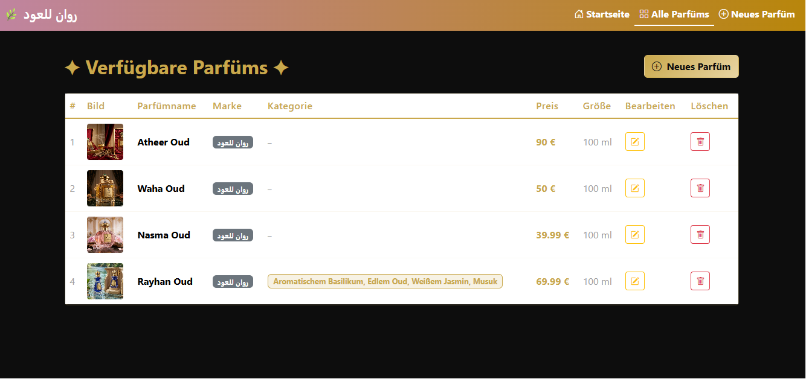
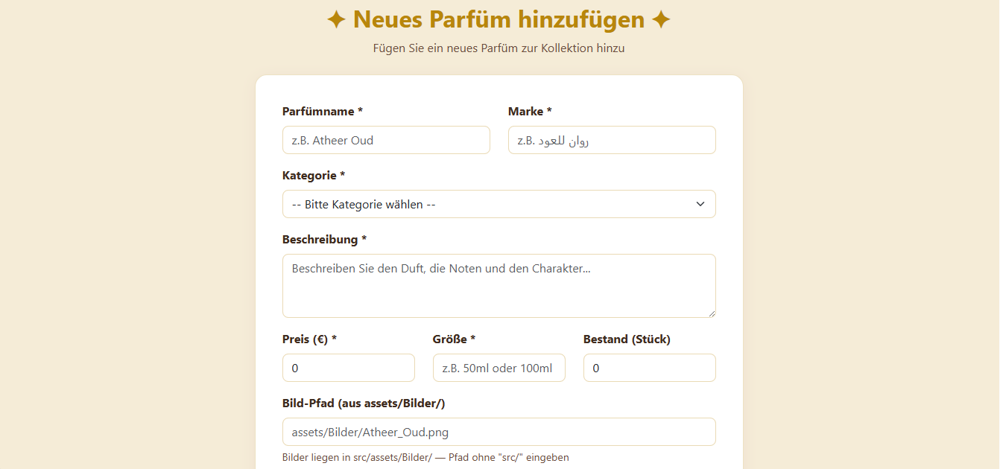

# 🌿 Rawan Oud (روان للعود)

Rawan Oud ist eine moderne E-Commerce-Webanwendung für arabische Luxusparfüme. 
Das Projekt wurde als WebTech-Semesteraufgabe an der HTW Berlin entwickelt und umfasst ein Frontend zur Präsentation der Parfüms sowie ein robustes Backend zur Datenverwaltung.

**Entwickelt von:** Rawan Alhussin 
**Betreuer:** Prof. J. Freiheit (HTW Berlin)  
**Kurs:** Webtech (Frontend & Backend)  
**Semester:** SS 2026 

- **Frontend:** Angular (Version 17) mit Standalone Components
- **Backend:** Node.js & Express.js
- **Datenbank:** MongoDB Compass (Mongoose)

---

## 📸 Screenshots


**1. Startseite mit Hero-Video:**


**2. Parfüm-Kollektion (Tabelle):**


**3. Neues Parfüm anlegen (Formular):**


---

## 🧪 Testing & Validierung

### Manuelles Testen

```bash
# 1. Backend antwortet
curl http://localhost:3000/perfumes

# 2. Frontend lädt
# Browser: http://localhost:4200

## ⚙️ Installation & Setup

### Voraussetzungen
* **Node.js** (lokal installiert)
* **Angular CLI** (falls nicht installiert: `npm install -g @angular/cli`)
* **Git** (zum Klonen des Repositories)
* **MongoDB** (Lokal installiert und laufend, z.B. über MongoDB Compass)

### Repository klonen
Öffne das Terminal und führe folgenden Befehl aus:
```bash
git clone https://github.com/RaWaN-2003-A/Parfuem_Frontend.git
**1. Navigiere in das Frontend-Verzeichnis:**
cd Parfuem_Frontend
## Frontend starten mit 
ng serve 
git clone https://github.com/RaWaN-2003-A/Parfuem_Backend.git
**2. Navigiere in das Backend-Verzeichnis:**
cd Parfuem_Backend
## Backend starten mit 
node server.js 
## Abhängigkeiten installieren
npm install 
### 1. Datenbank initialisieren (.env erstellen)
Erstelle eine Datei namens `.env` im Verzeichnis `Parfuem_Backend` und füge den folgenden Inhalt ein:

```env
DB_CONNECTION=mongodb://127.0.0.1:27017
DATABASE=rawan_db
PORT=3000
NODE_ENV=development

## 🎓 Lernziele erreicht

✅ **Angular verstanden:** Components, Services, Routing  
✅ **TypeScript:** Types, Interfaces, Generics  
✅ **Express/Node.js:** REST API, Routes, Error Handling  
✅ **MongoDB:** Schema-Design, CRUD-Operationen  
✅ **HTML/CSS:** Bootstrap, Responsive Design  
✅ **Git:** Versionskontrolle, Commit-Hygiene  
✅ **Datenfluss:** Frontend ↔ Backend ↔ MongoDB  

## 🤖 Verwendete KI-Tools
Im Rahmen der Erstellung dieser Semesteraufgabe wurde Künstliche Intelligenz (Claude/Gemini) unterstützend eingesetzt für:
* **Verständnisfragen:** Erläuterung komplexer Konzepte wie Angular-Services und Dependency Injection.
* **Debugging:** Unterstützung bei der Fehlersuche (z.B. bei Modul-Import-Fehlern).
* **Strukturierung:** Hilfe bei der logischen Planung der REST-API-Routen.
* **Dokumentation:** 

---

*Dieses Projekt folgt den Anforderungen von Prof. J. Freiheit (HTW Berlin, WebTech SS2026)*
© 2026 Rawan —   روان للعود